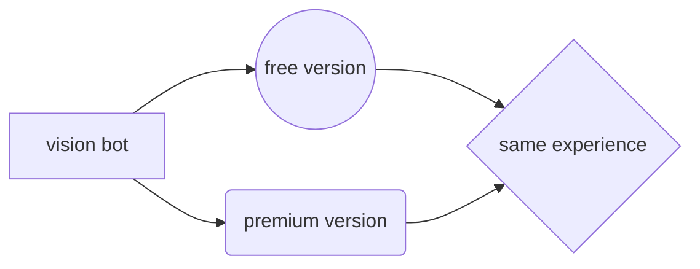

# Vision

***Vision*** is a highly customizable and interactive easy to use Discord Bot.  
The default prefix is a dot `.` Which is changeable  
  

In case after changing the prefix; you cannot remember what it was, just ping the bot and the bot will show the available guild prefixes such as personal and guild based.

### Key features include:

-   Information
-   Fun
-   LastFm
-   Moderation
-   Config
-   Roleplay
-   Utility
-    Image
-   Emoji
-   Antinuke
-   Crypto

### Information

Information commands are a good way to get information about **Vision**, report a bug or suggest something.

### Fun

Fun commands are a good way to pass some time while enjoying :D

### LastFm

LastFm lol what can i tell about it..

### Moderation

Manage the server and members quickly and easily. From punishing members to managing roles, power up moderation in your server!

### Config

Configure the server with voice master, welcome message and more stuff.

### Roleplay

Marry someone on **discord**(bruh), cuddle, kiss, be an e-dater.

### Utility

Customize the server with autoreact, reactionrole, autoresponder and much more.

### Image

Image commands?

### Emoji

Steal emojis such as stickers, lol.

### Antinuke

Antinuke system for better security for bad guys..

### Crypto

See how much is crypto worth..

# Premium 

***Vision*** also has a **_premium_** version that you can get by boosting our [support server](https://discord.gg/RTWSgYyHcx).

>  **ProTip:** **_Premium_** version has more benefits like shortened cooldown when using commands.

# Owners
|                |name|                      discord id|
|----------------|-------------------------------|-----------------------------|
||`sculex aka renat`            |`967771557348929556`            |
||`alex`            |`119931793972527109`        

    
# Extras
Apart from all this there are other useful commands such as stats, about and much more! There is no website since everything is in the bot itself (including all settings and permissions). This is to keep everything quick, simple and easy to access.

#### More detailed information can be founded at the [GitBook Page](https://visdocs.hood.baby/bot/embed-code-variables)
